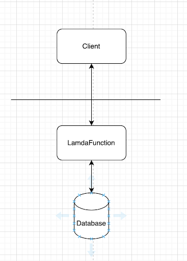
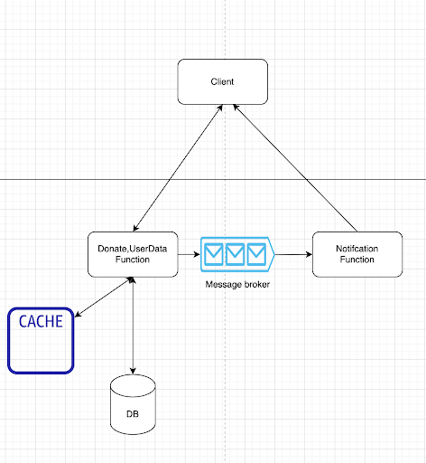

# Design Donate System
Build a service in Node.js that can be deployed to AWS which exposes an API and can be consumed from any client.
This service should check how many donations a user has made and send them a special thank you message (e.g. via SNS) if they make 2 or more donations.

## 1:Outline use case and constraints
### Usecase
- Save data about donate,user information.
- Check how many donations a user.
- Send message thank if user make 2 or more dations.

### Constraints and assumptions
- Scale follow request 
- Time execute need faster 
- Allow all request from anywhere
- Depend on sms service

### Caluclate usage.
- 730MB of stored for user,donation per month
    -- 7kb per record for donation  ⅓ * 10.000 * 30 per month
    -- 10kb per record for user * 10 * 30 new user per month
- (1  + ⅓) * 10.000 * 30 per month request
- ⅓ * 10.000 * 30 per month mail send

## 2: Create a high level design
> Outline a high level design with all important components.


#### Explain
- LamdaFunction: Include logic add user infor, donate from a user, check how many donation , send message.
- Database: save user data, donation data,
- Client: produce request from server,mobile,website

## 3: Design main function (component, service)
- Function: addUser, donate, sendMessageThankYou
```
// userData include: username,email, avatar ....
function addUser(userData){
   // check valid data for username, email
   validateUserData(userData);
 
   if (checkExistingUser(username)) {
       throw new Error(`Existing user`);
   }
 
   // default amount donation = 0
   saveUserInfoToDatabase(userData);
 
   return userData;
};

// donationData: userId,amount ...
function donate(donationData){
   // check valid data for userId,amount
   validateDonationData(donationData);
 
   user = getUser(userId);
 
   saveInfoDataToDatabase(donationData);
 
   amountTimeDonate = updateAmountTimeDonate(userId);
 
   if (amountTimeDonate >= 2) {
       sendSMS(userData);
   }
   return;
};
 
// Send Message ThankYou
function sendMessageThankYou(userData){
   smsContent = buildMessageContent(userData);
   sendMessage(smsContent);
};
```
- DataModel: UserModel, DonationModel

```
// UserModel
id: string;
username: string;
amountTimeDonate: number;
...

// DonationModel
id: string;
userId:string;
amount:number;
createdAt:Date
...
```

# 4: Scale the design
> Identify and address bottlenecks, given the constraints.



- Use caching for caching data of user reduce time get and update data for user
- Use message broker for async send sms when we have a lot of request the same time (bottleneck of sms service)
- Cross-Region DNS-based load balancing and failover

